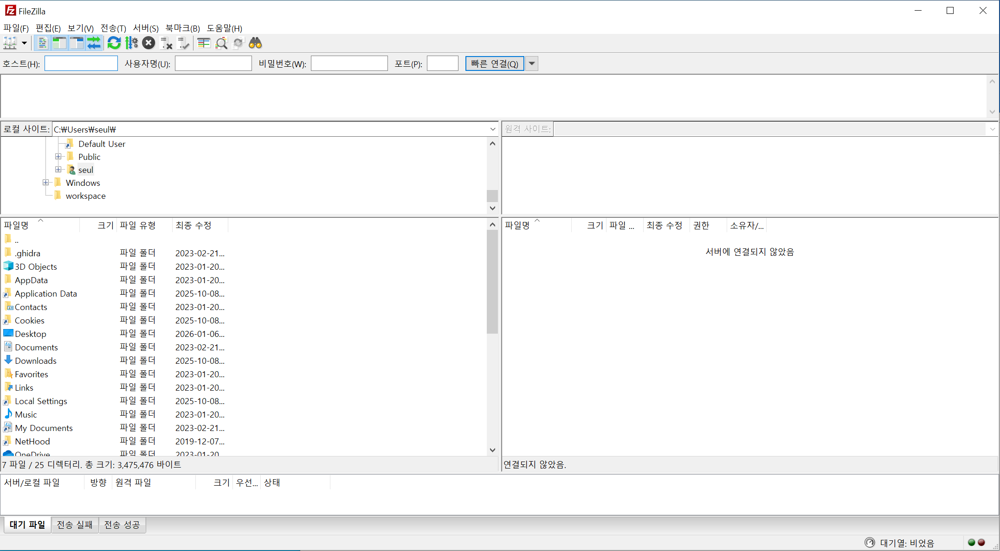
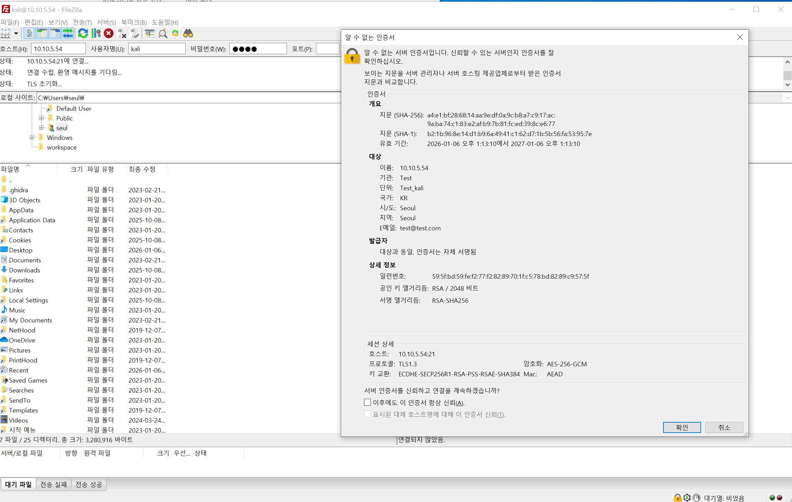
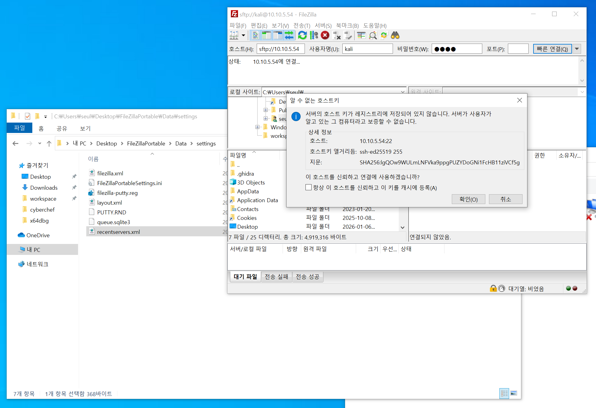
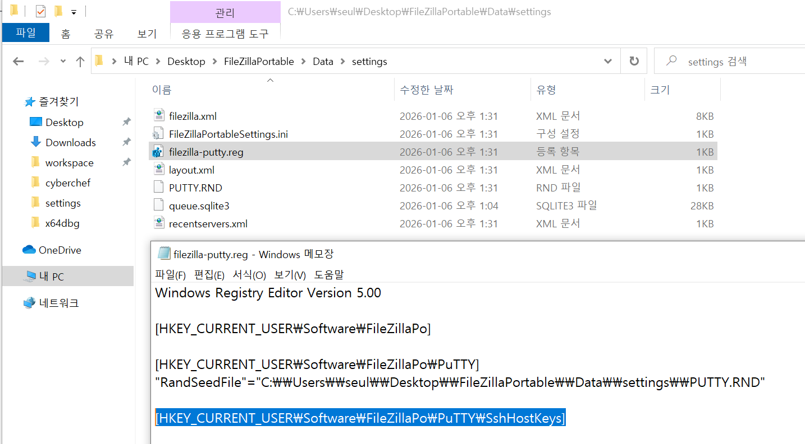
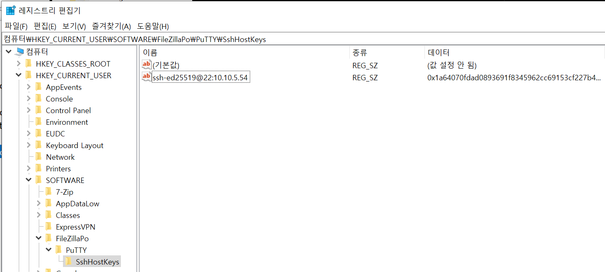

## Challenge
Checking traces of login success/failure/attempts when using FileZilla Portable

## Findings
**The generated files do not indicate whether a user successfully logged into services.**
### .\Data\settings\recentservers.xml
Files generated when a user attempts to connect
When you click the Save Password button, the base64-encoded password is saved in the `<Pass>` tag in the XML below. **You cannot determine whether the connection was successful.**
```xml
<?xml version="1.0" encoding="UTF-8"?>
<FileZilla3 version="3.69.3" platform="windows">
	<RecentServers>
		<Server>
			<Host>10.10.5.54</Host>
			<Port>21</Port>
			<Protocol>3</Protocol>
			<Type>0</Type>
			<User>kali</User>
			<Pass encoding="base64">dGVzdA==</Pass>
			<Logontype>1</Logontype>
			<PasvMode>MODE_DEFAULT</PasvMode>
			<EncodingType>Auto</EncodingType>
			<BypassProxy>0</BypassProxy>
		</Server>
	</RecentServers>
</FileZilla3>
```
### FTPS(port: 21) - .\Data\settings\trustedcerts.xml
If you select "Always trust this certificate in future sessions" afterward, `trustedcerts.xml` is created as shown below. **You cannot determine whether the connection was successful.**

```xml
<?xml version="1.0" encoding="UTF-8"?>
<FileZilla3 version="3.69.3" platform="windows">
	<TrustedCerts>
		<Certificate>
			<Data>308203e9308[redacted]]8c90ab2d149bea57b2</Data>
			<ActivationTime>1767672790</ActivationTime>
			<ExpirationTime>1799208790</ExpirationTime>
			<Host>10.10.5.54</Host>
			<Port>21</Port>
			<TrustSANs>0</TrustSANs>
		</Certificate>
	</TrustedCerts>
	<FtpSessionResumption>
		<Entry Host="10.10.5.54" Port="21">true</Entry>
	</FtpSessionResumption>
</FileZilla3>

```
### SFTP(port: 22) - HKEY_CURRENT_USER\Software\FileZillaPo\PuTTY\SshHostKeys
- In the dialog below, you must check the "Always trust this host, add key to cache" checkbox.
- If unchecked, the host key will not be registered in the registry. If checked, the key will be created. **You cannot determine whether the connection was successful.**


